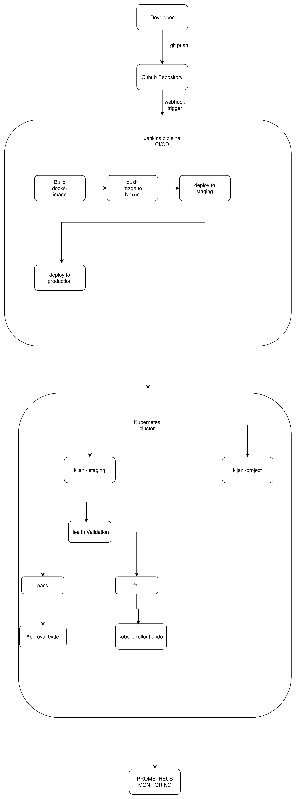

# KijaniKiosk Capstone Project — Track A

---

## What Is This?

KijaniKiosk is a production-approaching CI/CD pipeline for the `kk-payments` service — a payment processing microservice for a kiosk point-of-sale system. The project replaces manual `kubectl apply` deployments with a fully automated, approval-gated delivery pipeline: code pushed to GitHub triggers a Jenkins pipeline that builds, validates, and deploys the service through a staging environment before requiring human approval for production promotion. Infrastructure is provisioned with Terraform and the runtime is managed on Kubernetes (Minikube).

---

## Architecture

### Workflow

\`\`\`
GitHub → Jenkins → Docker Build → Kubernetes Staging → Rollout Validation → Smoke Test → Approval Gate → Production
\`\`\`

### Diagram

| Component | Role |
|---|---|
| GitHub | Source control and SCM trigger for Jenkins |
| Jenkins (Docker) | Orchestrates the full build, test, and deploy pipeline |
| Docker | Builds and tags the kk-payments container image |
| Minikube | Local Kubernetes cluster hosting staging and production namespaces |
| Terraform | Provisions kijani-staging and kijani-project namespaces as code |
| Ansible | Configures namespace-level Kubernetes resources |
| ConfigMaps & Secrets | Separate runtime configuration from the container image |
| Kubernetes probes | Liveness and readiness checks gate rollout success |

---

## Prerequisites

| Tool | Version | Install |
|---|---|---|
| Docker | 24+ | https://docs.docker.com/get-docker |
| Minikube | 1.38+ | https://minikube.sigs.k8s.io/docs/start |
| kubectl | 1.32+ | https://kubernetes.io/docs/tasks/tools |
| Terraform | 1.5+ | https://developer.hashicorp.com/terraform/install |
| Ansible | 2.14+ | https://docs.ansible.com/ansible/latest/installation_guide |
| Jenkins | LTS (Docker image kijani-jenkins) | Built locally — see Setup step 5 |
| Git | Any recent | https://git-scm.com |

---

## Setup

Run these commands in order from a clean checkout.

### 1. Clone the repository

\`\`\`bash
git clone https://github.com/essiewakukha/Kijani-capstone.git
cd Kijani-capstone
\`\`\`

### 2. Start Minikube

\`\`\`bash
minikube start
\`\`\`

### 3. Provision infrastructure with Terraform

\`\`\`bash
cd terraform
terraform init
terraform apply -auto-approve
cd ..
\`\`\`

This creates the kijani-staging and kijani-project namespaces in Minikube.

### 4. Apply Kubernetes manifests

\`\`\`bash
kubectl apply -f k8s/kk-payments-config.yaml -n kijani-staging
kubectl apply -f k8s/kk-payments-secrets.yaml -n kijani-staging
kubectl apply -f k8s/kk-payments-deployment.yaml -n kijani-staging

kubectl apply -f k8s/kk-payments-config.yaml -n kijani-project
kubectl apply -f k8s/kk-payments-secrets.yaml -n kijani-project
kubectl apply -f k8s/kk-payments-deployment.yaml -n kijani-project
\`\`\`

### 5. Start Jenkins

\`\`\`bash
docker run -d \
  --name jenkins \
  --network minikube \
  -p 8080:8080 \
  -p 50000:50000 \
  -v /var/run/docker.sock:/var/run/docker.sock \
  -v ~/.kube:/var/jenkins_home/.kube \
  -v ~/.minikube:/root/.minikube \
  kijani-jenkins
\`\`\`

Open Jenkins at http://localhost:8080 and configure the kijani-pipeline job pointing to this repository, branch feature/capstone-track-a.

---

## How to Run the Pipeline

1. Push a code change to the feature/capstone-track-a branch on GitHub
2. Open Jenkins at http://localhost:8080
3. The kijani-pipeline job triggers automatically or click Build Now
4. Watch the stages: Checkout → Build → Test → Deploy Staging → Smoke Test → Approve → Deploy Production
5. At the Approve Production Deploy stage Jenkins pauses for up to 30 minutes
6. Click Deploy to promote to production or Abort to cancel

---

## How to Verify It Works

### Staging is healthy

\`\`\`bash
kubectl get pods -n kijani-staging
# Expected: 3 pods, STATUS=Running, READY=1/1
\`\`\`

### Production is healthy

\`\`\`bash
kubectl get pods -n kijani-project
# Expected: 3 pods, STATUS=Running, READY=1/1
\`\`\`

### Rollout succeeded

\`\`\`bash
kubectl rollout status deployment/kk-payments -n kijani-project
# Expected: deployment "kk-payments" successfully rolled out
\`\`\`

### Service responds

\`\`\`bash
kubectl port-forward deployment/kk-payments 3000:3000 -n kijani-project &
curl http://localhost:3000/health
# Expected: HTTP 200
\`\`\`

### Rollback history exists

\`\`\`bash
kubectl rollout history deployment/kk-payments -n kijani-project
# Expected: at least 2 revisions listed
\`\`\`

---

## Known Limitations

| Limitation | Notes |
|---|---|
| Minikube only | The cluster runs locally. A cloud-managed cluster would be needed for production. |
| No Prometheus metrics endpoint | kk-payments does not expose /metrics. Alert rules are committed but not active. |
| No TLS or DNS | Service accessible only via kubectl port-forward. |
| Smoke test is shallow | Checks pod status only, not a live HTTP response. |
| No automated production rollback | Production rollback requires manual kubectl rollout undo. |
| Secrets not rotated | Static demo values. A production system would use a secrets manager. |

---

## AI Governance

All AI tool use is documented in the eight-field format in:

\`\`\`
docs/ai-governance-log.md
\`\`\`

---

## Release

\`\`\`bash
git tag -a v1.0.0 -m "Capstone submission: Track A production-grade Kubernetes CD pipeline"
git push origin v1.0.0
\`\`\`
